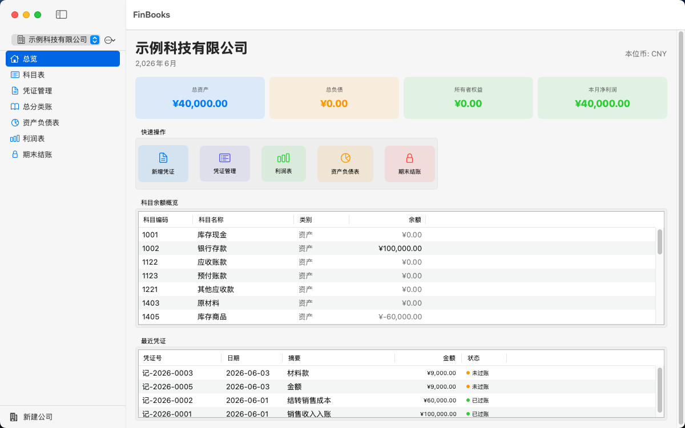

# FinBooks — 中小微企业财务管理软件

<p align="center">
  <b>macOS 原生 · 轻量离线 · 数据自主可控 · AI Agent 智能协同</b>
  <br>
  <i>符合会计准则 · 支持多公司 · 一键 PDF 导出 · 操作审计日志 · 企业所得税汇算清缴 · 审计底稿(CAS)</i>
</p>

<p align="center">
  
  
  
  
  
  
  
</p>

---

## 📖 目录

- [界面预览](#-界面预览)
- [为什么选择 FinBooks](#-为什么选择-finbooks)
- [快速开始](#-快速开始)
- [完整功能列表](#-完整功能列表)
- [AI 助手使用指南](#-ai-助手使用指南)
- [智能体插件安装](#-智能体插件安装)
- [Bridge HTTP API](#-bridge-http-api)
- [数据安全](#-数据安全)
- [技术架构](#-技术架构)
- [路线图](#-路线图)
- [贡献指南](#-贡献指南)

---

## 📸 界面预览

| 首页总览 | 资产负债表 | 利润表 |
|---|---|---|
|  |  |  |

---

## ✨ 为什么选择 FinBooks？

**FinBooks** 是一套专为中小微企业设计的 macOS 原生财务管理软件。它不只是一个"记账工具"，而是一个**符合会计规范、数据完全自主、支持 AI Agent 协同、满足外部审计和税务申报要求**的专业级财务平台。

| 痛点 | FinBooks 的解法 |
|---|---|
| 📋 纸质账本/Excel 难管理 | 结构化凭证体系，借贷自动平衡，编号自动连续 |
| 🔒 云端财务软件数据泄漏风险 | 完全离线，数据存本地，零网络依赖 |
| 💰 专业财务软件年费高昂 | 开源免费，MIT 许可，零商业限制 |
| 🤖 AI 时代不知道如何用 | 原生 AI Agent 集成，自然语言操作财务数据 |
| 🏛️ 外部审计/税务申报困难 | 一键导出 CAS 审计底稿 + 企业所得税汇算清缴数据 |
| 🔌 多智能体生态 | 同时适配 Hermes / OpenClaw / Codex，一键安装插件 |
| 💻 界面体验粗糙 | 纯 SwiftUI 原生，macOS 设计规范，约 50MB 内存 |

---

## 🚀 快速开始

### 方式一：下载预编译 App（推荐）

从 [Releases 页面](https://github.com/iMENGiCHAO/FinBooks/releases) 下载最新 `FinBooks.app`，拖入 `/Applications` 即可使用。

```
📦 FinBooks.app（Universal Binary，约 7MB）
   ├── Intel Mac（x86_64）→ 直接运行
   └── Apple Silicon（arm64）→ 直接运行
```

### 方式二：自行编译

```bash
git clone https://github.com/iMENGiCHAO/FinBooks.git
cd FinBooks
bash build.sh
open archive/FinBooks.app
```

**编译要求**：macOS 14.0+、Xcode Command Line Tools

### 首次使用

1. 启动应用 → 点击「新增公司」
2. 输入公司全称（如「北京某某科技有限公司」）
3. 系统自动创建完整标准科目表（28 个科目，覆盖资产/负债/权益/收入/费用五大类）
4. 开始录入凭证

---

## 📋 完整功能列表

### 🏢 公司管理
- 创建、切换、删除公司
- 每家公司独立账簿数据，完全隔离
- 公司信息（名称、税号）可编辑

### 📊 科目表
基于中国会计准则的完整科目编码体系（1001~6901），新建公司自动建账：

| 类别 | 编码范围 | 包含科目 |
|---|---|---|
| 资产类 | 1001~1901 | 库存现金、银行存款、应收账款、预付账款、其他应收款、原材料、库存商品、固定资产、累计折旧 |
| 负债类 | 2001~2901 | 短期借款、应付账款、预收账款、应付职工薪酬、应交税费、其他应付款、长期借款 |
| 权益类 | 4001~4901 | 实收资本、本年利润、利润分配 |
| 收入类 | 5001~5901 | 主营业务收入、其他业务收入、投资收益 |
| 费用类 | 6001~6901 | 主营业务成本、税金及附加、销售费用、管理费用、财务费用、所得税费用 |

支持自定义科目添加/删除，删除有凭证引用的科目自动拦截。

### 📝 凭证管理

| 功能 | 说明 |
|---|---|
| 新增凭证 | 多分录借贷行，金额实时汇总，默认一借一贷 |
| 自动编号 | 格式「记-2026-0001」，单调递增，删除不补号（审计合规） |
| 借贷平衡校验 | 录入和保存时强制检查不平自动提示差额 |
| 过账锁定 | 已过账凭证不可修改/删除，防止数据篡改 |
| 反过账 | 已过账凭证可反过账（已结账期间除外） |
| 凭证模板 | 常用业务模板一键录入（销售收入、采购付款、费用报销等） |
| 智能建议 | 根据摘要和金额自动匹配常用科目 |

### 🔒 期末结账
- 自动结转损益至本年利润，生成结转凭证
- **结账期间锁定** — 已结账期间不可新增/修改/删除凭证
- **重复结账防护** — 已结账期间再次操作时安全拒绝
- 支持反结账恢复
- 结账记录持久化，审计可追溯

### 📄 报表（PDF 导出）
基于 NSView 原生渲染引擎，中文字体完美嵌入：

| 报表 | 格式 | 内容 |
|---|---|---|
| 资产负债表 | 左右分栏 | 期末余额 + 年初余额，大类小计 |
| 利润表 | 上下结构 | 本期金额 + 本年累计，标准费用分类 |
| 现金流量表 | 三段式 | 经营/投资/筹资活动现金流 |
| 总分类账 | 逐笔流水 | 期初→本期发生→期末余额 |
| T 型账户 | 左右分列 | 借方/贷方发生额 + 余额 |
| 增值税申报表 | 税务格式 | 销项/进项/应纳/应补退税，税率分档 |

### 🏦 银行管理

| 功能 | 说明 |
|---|---|
| 银行账户 | 管理多个银行账户，记录账号/开户行 |
| 银行交易流水 | 导入银行交易，自动匹配会计科目 |
| 银行对账 | 企业账面余额 vs 银行对账单，自动生成调节表 |

### 🔧 固定资产管理
- 固定资产卡片（原值/残值/使用年限/折旧方法）
- 直线法自动计提折旧
- 固定资产清单 + 累计折旧汇总

### 📑 发票管理
- 发票录入（类型/号码/金额/税额/对方单位）
- 发票与凭证关联
- 进项/销项汇总，支持增值税申报联动

### 🛡️ 审计日志
`AuditLog` 模型记录全部关键操作，不可篡改：
- 凭证创建/修改/删除/过账/反过账
- 公司创建/删除
- 期间结账/反结账
- 插件安装/卸载
- 保留最近 1000 条

### 🏛️ 税务申报支持

| 功能 | 格式 | 说明 |
|---|---|---|
| 增值税申报 | JSON/CSV | 销项税/进项税/应纳/应补退税，按税率分档 |
| 企业所得税汇算清缴 | JSON/CSV | 会计利润 + 纳税调整项 + 应纳税所得额，A 类申报表格式 |
| 税务导出 | CSV | 含科目编码/名称的税局格式 |

### 📋 审计底稿导出
符合**中国注册会计师审计准则(CAS)**标准：
- **A 审计计划** — 重要性水平、审计策略
- **B 试算平衡表** — 全部科目期末借贷方余额
- **C 凭证抽查样本** — 按比例抽样，含平衡性检查
- **D 银行存款余额调节表** — 账面余额 + 未达账项
- **E 审计日志** — 全部操作痕迹

### 🔍 异常检测
自动扫描以下财务异常：
- 资产负债表不平
- 凭证借贷不平衡
- 科目出现异常负余额
- 大额异常交易
- 编号断号或跳号

### 🌐 全局搜索
- 按凭证号/摘要/科目名称/金额全局搜索
- 跨所有公司实时检索

### 🎨 原生体验
- SwiftUI + AppKit 纯原生，深色/浅色模式自动适配
- 内存占用约 50MB，启动毫秒级
- Universal Binary 同时支持 Intel + Apple Silicon

---

## 🤖 AI 助手使用指南

FinBooks 内建 AI Assistant 面板，位于 App 侧边栏「AI 助手」标签。它通过 FinBooks Bridge HTTP 服务（localhost:9090）为智能体提供实时数据通道。

### 三种使用方式

#### 方式一：App 内 AI 助手（推荐新手）

打开 FinBooks → 点击左侧「AI 助手」标签，直接在聊天框用自然语言操作财务数据：

| 你可以这样说 | 助手会做什么 |
|---|---|
| 「查一下银行存款余额」 | 调用 `finbooks_query_balance` 返回实时余额 |
| 「记录一笔办公用品支出 2000 元」 | 调用 `finbooks_create_entry` 创建借贷平衡的凭证 |
| 「帮我看看 6 月的利润表」 | 调用 `finbooks_income_statement` 格式化显示收入/费用/利润 |
| 「有没有异常凭证？」 | 调用 `finbooks_get_anomalies` 扫描不平/大额/负余额 |
| 「导出这个月的增值税申报数据」 | 调用 `finbooks_vat_report` 返回销项/进项/应纳税额 |

**快捷操作栏** 提供一键点击入口：总资产 · 本月利润 · 资产负债表 · 银行对账 · 企业所得税 · 审计底稿 · 税务导出

#### 方式二：配合 Hermes / OpenClaw / Codex 智能体

通过插件机制将 FinBooks 工具注入你的智能体，然后在智能体对话中直接操作：

```
你（在 Hermes 中）: 「FinBooks 里北京公司的 6 月利润是多少？」
Hermes: 调用 finbooks_income_statement → 返回收入 500,000，费用 320,000，净利润 180,000
```

#### 方式三：直接调用 Bridge API

适合自定义脚本或集成其他系统：

```bash
# 查询余额
curl http://localhost:9090/api/balance?code=1002

# 创建凭证
curl -X POST http://localhost:9090/api/entry/create \
  -H "Content-Type: application/json" \
  -d '{"summary":"销售收入","lines":[{"account_code":"1002","debit":100000,"credit":0},{"account_code":"5001","debit":0,"credit":100000}]}'

# 获取利润表
curl "http://localhost:9090/api/report/income?year=2026&month=6"
```

---

## 🔌 智能体插件安装

FinBooks 支持三种主流 AI 智能体：**Hermes**、**OpenClaw**、**Codex**。

### 一键安装（推荐）

1. 打开 FinBooks App
2. 点击左侧「AI 助手」
3. 点击「插件管理」
4. 点击「适配本地智能体」按钮

系统自动完成：
- 检测本机已安装的智能体（Hermes / OpenClaw / Codex）
- 安装对应插件文件到智能体插件目录
- 启动 FinBooks Bridge 服务（localhost:9090）
- 配置 launchd 开机自启动

### 导出插件包（分享给其他用户）

在同个面板点击「导出插件包」→ 生成 `finbooks-plugin.zip`（约 57KB），包含：
- Hermes 插件（`__init__.py` + `plugin.yaml`）
- OpenClaw 插件（`__init__.py` + `plugin.yaml`）
- Codex 插件（`plugin.json` + `SKILL.md`）
- FinBooks Bridge（`finbooks_bridge.py`）
- 一键安装脚本（`install.sh`）

其他用户拿到 zip 后，解压执行 `bash install.sh` 即可完成安装。

### 终端手动安装

```bash
cd /path/to/FinBooks
bash scripts/install_finbooks_plugin.sh
```

安装完成后，重启智能体即可在对话中使用 FinBooks 工具。

### 安装后验证

```bash
# 检查 Bridge 服务
curl http://localhost:9090/health
# 返回 {"status":"ok","version":"2.6.0",...}

# 检查插件目录
ls ~/.hermes/plugins/finbooks/    # Hermes
ls ~/.openclaw/plugins/finbooks/  # OpenClaw
ls ~/.codex/plugins/finbooks/     # Codex
```

### 22 个 AI 工具一览

| # | 工具名称 | 功能说明 |
|---|---|---|
| 1 | `finbooks_install_plugin` | 一键安装插件到智能体 |
| 2 | `finbooks_uninstall_plugin` | 卸载插件 |
| 3 | `finbooks_query_balance` | 查询科目实时余额 |
| 4 | `finbooks_list_accounts` | 列出所有科目 |
| 5 | `finbooks_list_entries` | 查询凭证列表 |
| 6 | `finbooks_get_totals` | 核心财务概览（总资产/负债/权益/收入/费用/利润） |
| 7 | `finbooks_income_statement` | 利润表 |
| 8 | `finbooks_balance_sheet` | 资产负债表 |
| 9 | `finbooks_cash_flow` | 现金流量表 |
| 10 | `finbooks_vat_report` | 增值税申报表 |
| 11 | `finbooks_general_ledger` | 总分类账（指定科目逐笔明细） |
| 12 | `finbooks_create_entry` | 创建记账凭证 |
| 13 | `finbooks_create_account` | 创建会计科目 |
| 14 | `finbooks_get_anomalies` | 财务异常扫描 |
| 15 | `finbooks_get_audit_logs` | 审计日志查询 |
| 16 | `finbooks_export_csv` | CSV 数据导出 |
| 17 | `finbooks_trial_balance` | 试算平衡表 |
| 18 | `finbooks_aging_report` | 应收/应付账龄分析 |
| 19 | `finbooks_audit_export` | 审计数据包导出 |
| 20 | `finbooks_tax_export` | 增值税申报数据导出 |
| 21 | `finbooks_tax_cit` | 企业所得税汇算清缴 |
| 22 | `finbooks_audit_working_paper` | CAS 审计底稿导出 |

---

## 🌐 Bridge HTTP API

FinBooks Bridge 是一个独立的 Python HTTP 服务（`scripts/finbooks_bridge.py`），在 `localhost:9090` 提供 REST API。

### 启动/停止

```bash
# 启动（默认 9090 端口）
python3 scripts/finbooks_bridge.py

# 指定端口
python3 scripts/finbooks_bridge.py --port 8080

# 停止
pkill -f finbooks_bridge
```

### API 端点完整列表

| 方法 | 路径 | 说明 |
|---|---|---|
| GET | `/health` | 健康检查 + 数据统计 |
| GET | `/api/accounts` | 科目列表 |
| GET | `/api/balance?code=1002` | 科目余额查询 |
| GET | `/api/entries?year=2026&month=6` | 凭证列表查询 |
| GET | `/api/totals` | 财务总览 |
| GET | `/api/report/income?year=2026&month=6` | 利润表 |
| GET | `/api/report/balance-sheet?date=2026-06-08` | 资产负债表 |
| GET | `/api/report/cash-flow?year=2026&month=6` | 现金流量表 |
| GET | `/api/report/vat?year=2026&month=6` | 增值税申报表 |
| GET | `/api/report/general-ledger?code=1002&year=2026&month=6` | 总分类账 |
| GET | `/api/report/trial-balance?year=2026&month=6` | 试算平衡表 |
| GET | `/api/report/aging?year=2026&month=6` | 账龄分析 |
| GET | `/api/anomalies` | 异常检测 |
| GET | `/api/audit-logs?limit=50` | 审计日志 |
| GET | `/api/export/csv?report_type=vat&year=2026&month=6` | CSV 导出 |
| GET | `/api/tax/corporate-income-tax?year=2026` | 企业所得税汇算清缴 |
| GET | `/api/audit/working-paper?year=2026&month=6` | 审计底稿导出 |
| POST | `/api/entry/create` | 创建凭证 |
| POST | `/api/account/create` | 创建科目 |
| POST | `/api/plugin/register` | 注册智能体 |
| POST | `/api/plugin/unregister` | 注销智能体 |
| GET | `/api/plugin/manifest` | 插件清单 |
| GET | `/api/plugin/download` | 下载插件包(ZIP) |

### 配置化

Bridge 支持通过 `~/.finbooks/config.json` 自定义：

```json
{
  "bridge_port": 9090,
  "companyInfo": {
    "name": "示例科技有限公司",
    "taxId": "91440101MA5XXXXXXX"
  },
  "taxRates": {
    "corporateIncomeTax": 0.25,
    "vat": { "standard": 0.13, "low": 0.06, "zero": 0.00 }
  },
  "vatAccountCodes": {
    "outputTax": ["22210001", "22210002"],
    "inputTax":  ["22210003", "22210004"]
  }
}
```

---

## 🔐 数据安全

- ✅ **完全离线** — 无需网络，数据不离开你的电脑
- ✅ **本地存储** — `~/Library/Application Support/com.finbooks.app/`
- ✅ **原子写入** — JSON 保存使用系统 atomic write，防止文件损坏
- ✅ **自动备份** — 每次保存生成带时间戳的备份（保留 30 天）
- ✅ **零数据采集** — 不含任何分析 SDK、遥测、统计组件
- ✅ **开源审计** — 全部源码开放，任何人都可以审查
- ✅ **审计日志** — 所有关键操作不可篡改记录

---

## 🏗️ 技术架构

```
FinBooks
│
├─ SwiftUI 视图层（20 个 View）
│  ├─ DashboardView       — 首页总览 + KPI 卡片
│  ├─ JournalEntriesView  — 凭证录入/列表/过账
│  ├─ ChartOfAccountsView — 科目表管理
│  ├─ BalanceSheetView    — 资产负债表
│  ├─ IncomeStatementView — 利润表
│  ├─ CashFlowStatementView — 现金流量表
│  ├─ GeneralLedgerView   — 总分类账
│  ├─ TAccountView        — T 型账户
│  ├─ VATReportView       — 增值税申报表
│  ├─ PeriodCloseView     — 期末结账/反结账
│  ├─ BankAccountView     — 银行账户管理
│  ├─ BankReconciliationView — 银行对账
│  ├─ FixedAssetView      — 固定资产管理
│  ├─ InvoiceListView     — 发票管理
│  ├─ GlobalSearchView    — 全局搜索
│  ├─ AIChatView          — AI 助手 + 插件管理
│  └─ SettingsView        — 设置 + 备份恢复
│
├─ Helpers 业务逻辑层（12 个 Helper）
│  ├─ AccountingEngine     — 核心会计引擎（余额计算、结转、报表等 1000+ 行）
│  ├─ AIAssistant          — AI 助手对话逻辑
│  ├─ AgentConfig          — 智能体配置管理
│  ├─ AnomalyDetector      — 财务异常扫描
│  ├─ CurrencyManager      — 金额格式化
│  ├─ Formatter            — 通用格式化工具
│  ├─ InvoiceParser        — 发票解析
│  ├─ PDFExporter          — PDF 报表导出（原生渲染引擎）
│  ├─ VoucherSuggester     — 凭证智能建议
│  └─ VoucherTemplates     — 凭证模板
│
├─ DataStore 数据层
│  ├─ Models.swift         — Company / Account / JournalEntry / PeriodClose / AuditLog 等
│  ├─ JSON 文件存储（atomic write）
│  └─ 自动备份（保留 30 天）
│
├─ FinBooks Bridge（Python HTTP 服务）
│  └─ finbooks_bridge.py   — 3377 行 REST API + 22 个端点
│
└─ 智能体插件
   ├─ .codex-plugin/       — Codex 插件（plugin.json + SKILL.md）
   ├─ .hermes-plugin/      — Hermes 插件（580 行 __init__.py + plugin.yaml）
   └─ .openclaw-plugin/    — OpenClaw 插件（487 行 __init__.py + plugin.yaml）
```

### 技术栈

| 层次 | 技术 |
|---|---|
| UI 框架 | SwiftUI 3+ |
| 系统框架 | AppKit（PDF 导出、原生窗口管理） |
| 持久化 | JSON 文件存储（atomic write 防数据损坏） |
| 语言 | Swift 5.10+ / Python 3.10+ |
| 最低部署 | macOS 14.0 |
| 架构 | Universal Binary（Intel + Apple Silicon） |
| AI 集成 | Hermes / OpenClaw / Codex（通过 Bridge HTTP API + 插件） |
| 通信协议 | REST（JSON） |

---

## 🗺️ 路线图

### v2.6.0 ✅ 当前版本
- [x] 企业所得税汇算清缴（CIT）
- [x] CAS 审计底稿导出
- [x] 三端智能体插件分发
- [x] Bridge `--port` 参数
- [x] 增值税申报表
- [x] 现金流量表

### v2.7 — 计划中
- [ ] Excel/CSV 凭证批量导入
- [ ] 账簿打印（总账、明细账、日记账）
- [ ] 多币种支持
- [ ] 税局 XML 格式直接导出

### v3.0 — 企业级
- [ ] 用户权限管理（会计/出纳/审核角色分离）
- [ ] 操作审计日志可视界面
- [ ] 电子发票 OCR 识别 → 自动生成凭证
- [ ] 多设备局域网协同

---

## 🤝 贡献指南

欢迎各种形式的贡献！无论是 Bug 报告、功能建议还是 PR：

1. Fork 本仓库
2. 创建特性分支：`git checkout -b feature/awesome-feature`
3. 提交改动：`git commit -m 'Add awesome feature'`
4. 推送分支：`git push origin feature/awesome-feature`
5. 提交 Pull Request

### 项目结构速查

```
FinBooks/
├── Sources/FinBooks/       # Swift 源码
│   ├── Views/              # 20 个 SwiftUI 视图
│   ├── Helpers/            # 12 个业务逻辑模块
│   └── Models/             # 数据模型 + DataStore
├── scripts/                # Python Bridge + 安装脚本 + 演示数据
├── .codex-plugin/          # Codex 智能体插件
├── .hermes-plugin/         # Hermes 智能体插件
├── .openclaw-plugin/       # OpenClaw 智能体插件
├── build.sh                # 编译脚本
└── screenshots/            # 截图
```

---

## 📄 许可证

[MIT License](LICENSE)

Copyright © 2026 iMENGiCHAO

---

<p align="center">
  <b>FinBooks</b> — 让中小微企业拥有专业级的财务管理工具
  <br>
  <sub>⭐ 如果这个项目对你有帮助，请给一个 Star</sub>
</p>

<p align="center">
  <a href="https://github.com/iMENGiCHAO/FinBooks/issues">📮 反馈问题</a>
  ·
  <a href="https://github.com/iMENGiCHAO/FinBooks/discussions">💬 讨论交流</a>
  ·
  <a href="https://github.com/iMENGiCHAO/FinBooks/releases">📦 下载最新版</a>
</p>
