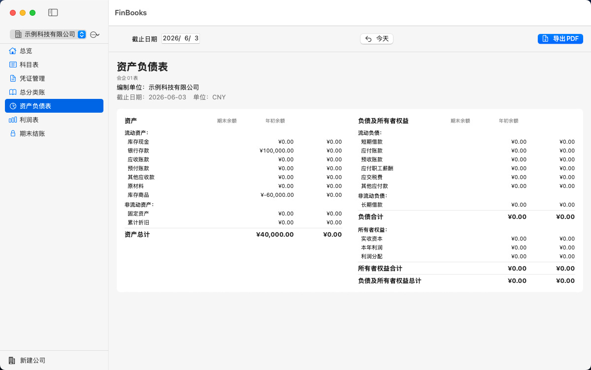
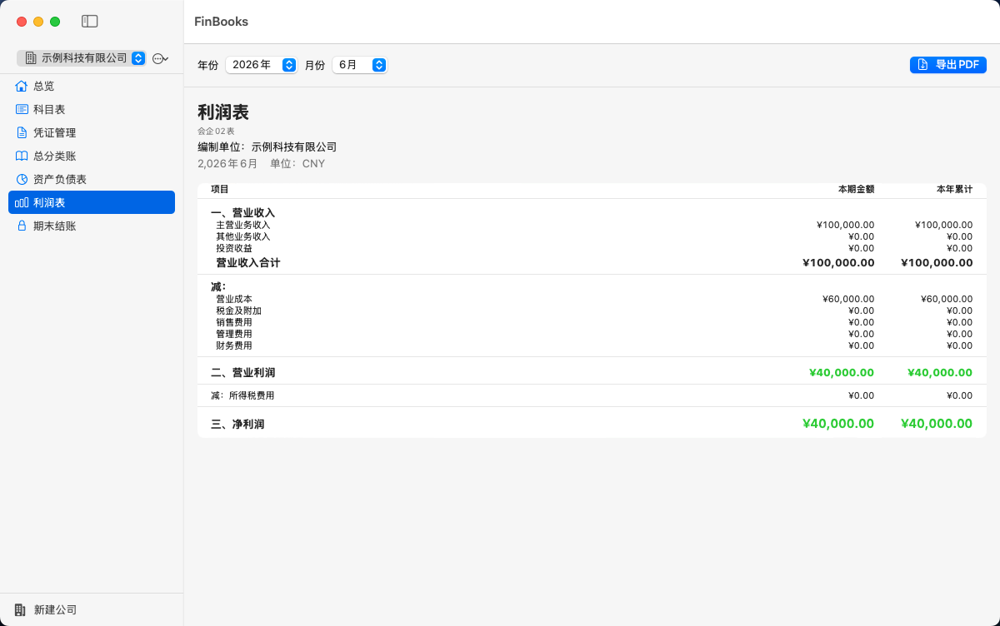

# FinBooks

> **中国中小微企业财务管理软件 — macOS 原生应用**
>
> 符合中国会计准则，覆盖凭证管理、科目表、期末结账、财务报表全流程。
> 轻量级、离线运行、数据自主可控。

---

## 目录

- [核心特性](#核心特性)
- [界面预览](#界面预览)
- [系统要求](#系统要求)
- [快速开始](#快速开始)
- [详细功能](#详细功能)
  - [公司管理](#公司管理)
  - [科目表](#科目表)
  - [凭证管理](#凭证管理)
  - [期末结账](#期末结账)
  - [报表与导出](#报表与导出)
- [技术架构](#技术架构)
- [数据安全](#数据安全)
- [构建指南](#构建指南)
- [路线图](#路线图)
- [许可证](#许可证)

---

## 核心特性

✅ **多公司管理** — 同一应用内管理多家公司账簿，数据完全隔离

✅ **标准科目表** — 基于中国会计准则的科目编码体系（1001~6901），自动建账

✅ **凭证管理** — 新增、编辑、删除、过账、反过账，支持多分录（借贷行）

✅ **借贷平衡校验** — 录入和过账时强制检查借贷金额平衡，不平衡拒绝操作

✅ **连续编号** — 凭证编号自动生成，删除凭证后编号自动复用，杜绝跳号

✅ **期末结账** — 自动结转损益至本年利润，结账期间所有 CRUD 操作全锁定

✅ **财务报表** — 资产负债表、利润表、总分类账，一键导出 PDF

✅ **科目删除保护** — 已被凭证引用的科目不可删除，防止数据不一致

✅ **离线运行** — 本地存储，无需网络，数据完全由用户掌控

✅ **原生体验** — 基于 SwiftUI + AppKit，纯 macOS 原生应用，低内存占用

---

## 界面预览

> *（此处可插入截图）*
>
> | 凭证录入 | 科目表 | 财务报表 |
> |---|---|---|
> |  |  |  |

---

## 系统要求

| 项目 | 要求 |
|---|---|
| 操作系统 | macOS 14.0+ (Sonoma 及以上) |
| 处理器 | Apple Silicon (M1/M2/M3/M4) 或 Intel x86_64 |
| 内存 | ≥ 256MB（实际使用约 50MB） |
| 磁盘 | 约 20MB（不含数据） |
| 网络 | 仅首次下载需要，运行完全离线 |
| 权限 | 无需网络/麦克风/摄像头/定位等特殊权限 |

---

## 快速开始

### 方式一：下载预编译版本

从 [Releases](https://github.com/iMENGiCHAO/FinBooks/releases) 下载最新 `FinBooks.app`，拖入「应用程序」文件夹即可使用。

### 方式二：自行编译

```bash
# 克隆仓库
git clone https://github.com/iMENGiCHAO/FinBooks.git
cd FinBooks

# 一键编译
bash build.sh

# 产物位于 archive/FinBooks.app
open archive/
```

编译完成后，将 `FinBooks.app` 拖入「应用程序」文件夹即可。

### 首次使用

1. 启动应用，点击「新增公司」
2. 输入公司名称（如「北京某某科技有限公司」）
3. 系统自动创建标准科目表
4. 开始录入凭证

> **提示**：首次使用建议先录入期初余额凭证，再进行日常记账。

---

## 详细功能

### 公司管理

- 支持创建、切换、删除公司
- 每家公司拥有完全独立的科目表、凭证和账簿数据
- 公司名称可修改
- 删除公司时自动清理全部关联数据

### 科目表

- 默认创建资产负债表类 + 损益类全量科目，覆盖：
  - **资产类**：1001~1901（库存现金、银行存款、应收账款、存货、固定资产等）
  - **负债类**：2001~2901（短期借款、应付账款、应付职工薪酬、应交税费等）
  - **共同类**：3001（清算资金往来）
  - **权益类**：4001~4901（实收资本、资本公积、盈余公积、本年利润、利润分配）
  - **成本类**：5001~5401（生产成本、制造费用）
  - **损益类**：6001~6901（营业收入、营业成本、管理费用、销售费用、财务费用、所得税费用等）
- 支持新增自定义科目
- 删除科目时自动检测是否被凭证引用，引用中则禁止删除
- 科目编码和名称可修改

### 凭证管理

- **新增凭证**：
  - 自动生成连续编号（支持编号复用已删除空缺）
  - 摘要、科目、借方金额、贷方金额逐行录入
  - 默认至少 2 行分录，支持动态添加/删除分录行
  - 借贷金额实时汇总显示
  - 保存时强制借贷平衡检查，不平则拒绝保存并提示差额

- **凭证状态**：
  - `未过账` — 可编辑、可删除
  - `已过账` — 只读查看，如需修改必须先反过账
  - 过账时再次校验借贷平衡，不平衡则拒绝过账
  - 已过账凭证编辑后保持过账状态不变

- **凭证列表**：
  - 按日期倒序排列
  - 实时显示每张凭证的借贷总额
  - 不同着色区分已过账/未过账

### 期末结账

- **结账操作**：
  - 选择要结账的会计期间（年-月）
  - 系统自动将损益类科目余额结转至「本年利润」
  - 结账后该期间标记为「已结账」

- **结账锁定**：
  - 已结账期间的凭证**不可新增、不可编辑、不可删除、不可过账、不可反过账**
  - 科目表在该期间的修改被禁止
  - 防止财务人员意外修改已封账数据，符合财务规范

- **反结账**：
  - 支持对已结账期间执行反结账
  - 反结账后恢复该期间的所有操作权限

### 报表与导出

支持三种标准财务报表，均导出为高质量 PDF：

| 报表名称 | 说明 |
|---|---|
| **资产负债表** | 展示截至指定日期的资产、负债、所有者权益结构 |
| **利润表** | 展示指定期间的收入、成本、费用及净利润 |
| **总分类账** | 按科目汇总所有凭证，展示期初余额、本期发生额、期末余额 |

PDF 导出特点：
- 使用 NSView 原生渲染引擎，中文字体完美嵌入
- 清晰表格排版，金额千分位格式
- A4 纵向布局，适合打印和存档
- 文件名包含公司名称和日期，方便归档管理

---

## 技术架构

```
┌─────────────────────────────────────────────┐
│                  SwiftUI                     │
│  ┌──────────┬──────────┬──────────────────┐  │
│  │ 凭证录入  │ 科目表    │ 报表与导出        │  │
│  ├──────────┼──────────┼──────────────────┤  │
│  │ 凭证列表  │ 期末结账  │ 公司管理          │  │
│  └──────────┴──────────┴──────────────────┘  │
├─────────────────────────────────────────────┤
│              AccountingEngine                │
│  ┌──────────┬──────────┬──────────────────┐  │
│  │ 余额计算  │ 期末结转  │ 凭证编号生成      │  │
│  ├──────────┼──────────┼──────────────────┤  │
│  │ 报表生成  │ 借贷校验  │ 科目表管理        │  │
│  └──────────┴──────────┴──────────────────┘  │
├─────────────────────────────────────────────┤
│                  DataStore                   │
│  ┌──────────┬──────────┬──────────────────┐  │
│  │ Company  │ Account  │ JournalEntry     │  │
│  ├──────────┼──────────┼──────────────────┤  │
│  │ PeriodClose │        │                  │  │
│  └──────────┴──────────┴──────────────────┘  │
└─────────────────────────────────────────────┘
```

**技术栈**:

| 层次 | 技术 |
|---|---|
| UI 框架 | SwiftUI 3+ |
| 系统框架 | AppKit (PDF 导出) |
| 持久化 | JSON 文件存储 (轻量级，无需数据库引擎) |
| 语言 | Swift 5.9+ |
| 最低部署目标 | macOS 14.0 |
| 构建方式 | Swift Package Manager + Xcode |

**架构特点**:

- **分层架构**：视图层（SwiftUI）→ 业务逻辑层（AccountingEngine）→ 数据层（DataStore），职责清晰
- **响应式数据流**：@Published + @ObservableObject 驱动 UI 自动刷新
- **离线优先**：所有数据本地存储，不依赖任何外部服务

---

## 数据安全

- **完全离线**：应用无需网络连接，数据不会离开你的电脑
- **本地存储**：数据以 JSON 格式保存在 `~/Library/Application Support/FinBooks/` 目录下
- **自主可控**：用户可随时备份、迁移或删除数据文件
- **无数据采集**：不包含任何分析 SDK 或遥测组件
- **无外部依赖**：不调用任何第三方 API 或云服务

**数据备份建议**：定期备份 `~/Library/Application Support/FinBooks/` 目录下的 JSON 文件即可。

---

## 构建指南

### 前置条件

- macOS 14.0+ 开发环境
- Xcode 15.0+ 或 Command Line Tools for Xcode 15.0+
- Swift 5.9+

### 编译命令

```bash
# 一键编译（Universal Binary）
bash build.sh

# 或手动编译
swift build -c release --arch arm64 --arch x86_64
```

### 运行

```bash
open archive/FinBooks.app
```

### 调试模式

```bash
swift run
```

---

## 路线图

当前版本（v1.0.0）为基础稳定版，后续计划：

### v1.x — 功能完善
- [ ] Excel/CSV 凭证批量导入导出
- [ ] 现金流量表
- [ ] 账簿打印（总账、明细账、日记账）
- [ ] 多币种支持

### v2.x — 企业级特性
- [ ] 用户权限管理（会计/出纳/审核角色分离）
- [ ] 操作审计日志
- [ ] 电子发票识别与自动生成凭证
- [ ] iCloud 多设备同步

### v3.x — 智能财务
- [ ] AI 辅助记账（自然语言生成凭证）
- [ ] 智能财务分析报告
- [ ] 税务申报数据导出

---

## 许可证

[MIT License](LICENSE)

Copyright © 2026 iMENGiCHAO

---

**FinBooks** — 让中小企业拥有专业级的财务管理工具。
